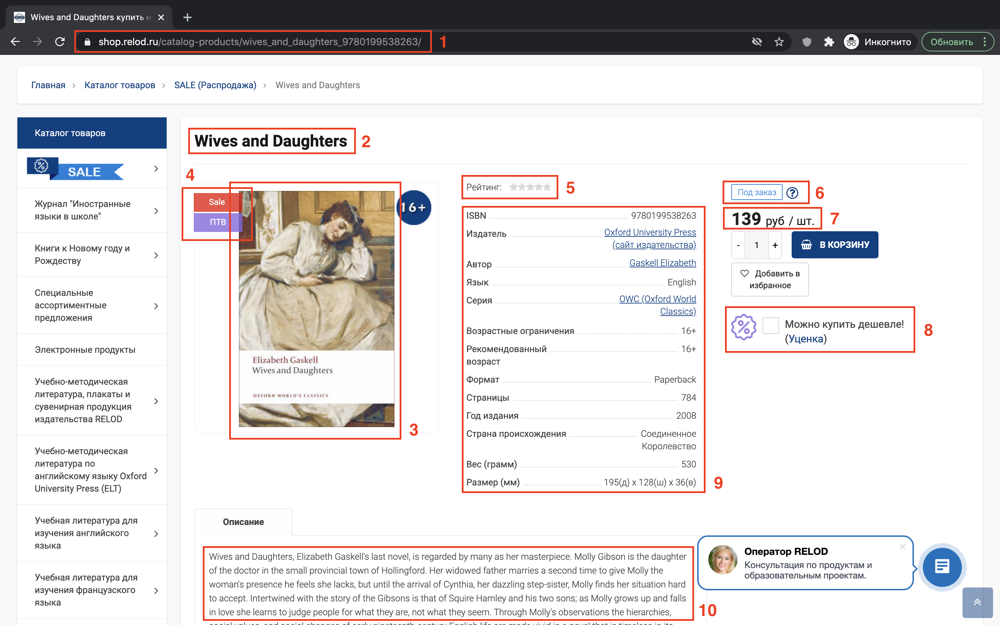

# Многопоточный парсинг сайта на Python

Мини-проект по обкачке книжного магазина ["Relod"](https://shop.relod.ru/) с использованием библиотеки [BeautifulSoup](https://www.crummy.com/software/BeautifulSoup/bs4/doc/). Программа скачивает информацию о самых популярных книгах из раздела ["Художественная литература"](https://shop.relod.ru/catalog-products/4577/?sort=PROPERTY_RATING&order=desc).

Результатом работы программы является файл с таблицей из всех найденных книг.

## Общий подход к решению задачи

Задачу условно можно разделить на три этапа. На первом этапе получаем ссылки на все нужные книги из раздела, на втором – получаем информацию о каждой из книг, на третьем – сгруппируем информацию обо всех книгах в одну таблицу.

### Этап 1. Получение ссылок на книги раздела

Для получения всех ссылок на книги нужно обкачать первые 90 страниц раздела. Существует два способа это сделать.

#### Способ 1.

Переключаясь между страницами раздела можно заметить, как меняется URL страницы (появляется параметр `PAGEN_1`). Варьируя это значение в диапазоне от 1 до 90 можно обкачать все требуемые страницы.

#### Способ 2. 

Внизу страницы находится кнопка "Показать ещё", нажимая на которую происходит подгрузка выдачи карточек книг со следующей страницы. Можно эмулировать поведение при нажатии на эту кнопку через обращение к скрытому API сайта.

Я реализовал оба способа и сравнил время их работы.

### Этап 2. Получение информации о книгах

Рассмотрим в качестве примера карточку книги Элизабет Гаскелл «Жёны и дочери».



На скриншотах выделены 10 областей, из каждой области извлекаем следующие элементы:

1. поле "URL" (ссылка на книгу);
2. поле "Название";
3. поле "Иллюстрации" (список из ссылок на изображения, предоставленные к книге);
4. поле "Метки" (список меток, всего их 4 вида: Sale, New, Хит, ПТВ);
5. поля "Оценка" и "Число голосов" (количество звезд у книги и количество пользователей, оценивших книгу);
6. поле "Наличие" (товар в наличии или доступен под заказ);
7. поле "Цена";
8. поле "Цена (скидка)" (цена уцененного товара, ее можно увидеть на сайте проставив галочку);
9. все поля из таблицы;
10. поле "Описание".


Таким образом карточка из примера представима в виде следующего json-а:

```json
{
    "url": "https://shop.relod.ru/catalog-products/wives_and_daughters_9780199538263/",
    "Название": "Wives and Daughters",
    "Оценка": 0,
    "Число голосов": 0,
    "Наличие": "Под заказ",
    "Цена": 139.0,
    "Цена (скидка)": 111.2,
    "Метки": [
        "Sale",
        "ПТВ"
    ],
    "Описание": "Wives and Daughters, Elizabeth Gaskell's last novel, is regarded by many as her masterpiece. Molly Gibson is the daughter of the doctor in the small provincial town of Hollingford. ...",
    "Иллюстрации": [
        "https://opt-1458870.ssl.1c-bitrix-cdn.ru/upload/iblock/b56/b5612e1932cafcd6cf5f0895eab8c426.jpg?153149314326232"
    ],
    "ISBN": "9780199538263",
    "Издатель": "Oxford University Press",
    "Автор": "Gaskell Elizabeth",
    "Язык": "English",
    "Серия": "OWC (Oxford World Classics)",
    "Возрастные ограничения": "16+",
    "Рекомендованный возраст": "16+",
    "Формат": "Paperback",
    "Страницы": "784",
    "Год издания": "2008",
    "Страна происхождения": "Соединенное Королевство",
    "Вес (грамм)": "530",
    "Размер (мм)": "195(д) х 128(ш) х 36(в)"
}
```
Обратим внимание, что некоторые поля из таблицы, например: "Носитель", "Серия", "Уровень" — отсутствуют именно для этой карточки, но могут присутствовать в других карточках.
Сохраняются только те поля, которые есть у карточки.


#### Параллелизация обкачки

Так как большую часть времени парсинга занимают скачивание карточки (I/O-операция) и обращения к библиотекам парсинга (имеют основу, написанную на C++), можно воспользоваться параллелизацией с использованием потоков, используя модуль multiprocessing.

Для того, чтобы не хранить все скачанные карточки в оперативной памяти, посадим каждый поток на свой файл:

* поток зачитывает URL из очереди;
* скачивает и парсит страницу;
* результат сохраняет в файл.

### Этап 3. Объединение результатов

Теперь остается объединить все файлы вместе в итоговый `pd.DataFrame` через генератор `records_reader(dirname)`, который будет зачитывать записи (словарь) из всех файлов.

